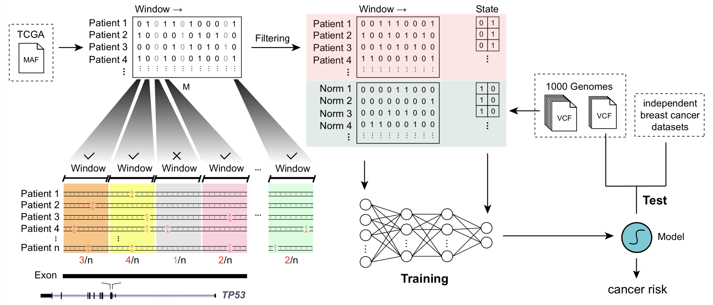

.. MiScan documentation master file, created by
   sphinx-quickstart on Mon Jul 29 19:42:42 2019.
   You can adapt this file completely to your liking, but it should at least
   contain the root `toctree` directive.

|Tag| |PyPI| |Status| |Docs| |Docker| |Licence|

.. |PyPI| image:: https://img.shields.io/pypi/v/miscan.svg
    :alt: PyPI latest version
    :target: https://pypi.org/project/MiScan/

.. |Docs| image:: https://readthedocs.org/projects/miscan-cli/badge/?version=latest
    :alt: readthedocs auoto build
    :target: https://miscan-cli.readthedocs.io

.. |Docker| image:: https://img.shields.io/docker/cloud/automated/jefferyustc/miscan_command_line
    :alt: Docker Cloud Automated build

.. |Licence| image:: https://img.shields.io/github/license/jefferyUstc/MiScan_cli
    :alt: Apache License version2
    :target: http://www.apache.org/licenses/

.. |Tag| image:: https://img.shields.io/github/v/tag/jefferyUstc/Miscan_cli
    :alt: GitHub tag (latest by date)

.. |Status| image:: https://img.shields.io/pypi/status/MiScan
    :alt: PyPI - Status

MiScan: Maxout-inferred SNV-based cancer prediction model
==============================================================
|

|

Here we present a Maxout-inferred SNV-based cancer prediction model (MiScan) for screening of breast cancer patients
using genotype information from blood samples. We coarsened 119,318 variants into 13,885 genomic windows, and trained
MiScan with coarse-grained mutation information from 986 breast cancer patients and 2,003 healthy people. To promote
the application of MiScan for breast cancer prediction and prevention, we established an interactive website_, which
automatically provides a breast cancer risk assessment feedback report from genotype information as input.

.. toctree::
   :maxdepth: 1
   :caption: Contents:

   installation
   tutorial
   references
   API/index

.. _website: http://qulab.ustc.edu.cn/miscan
