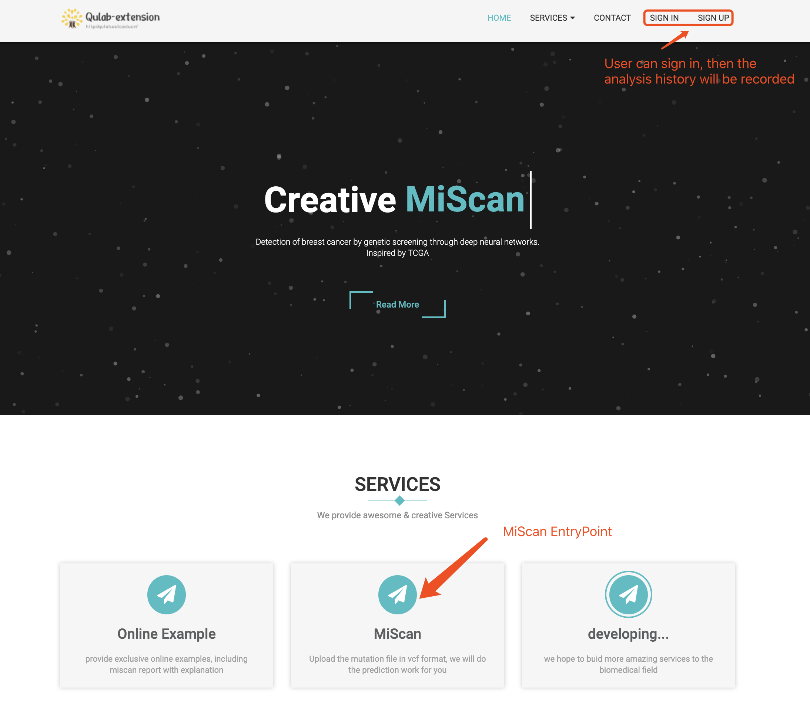
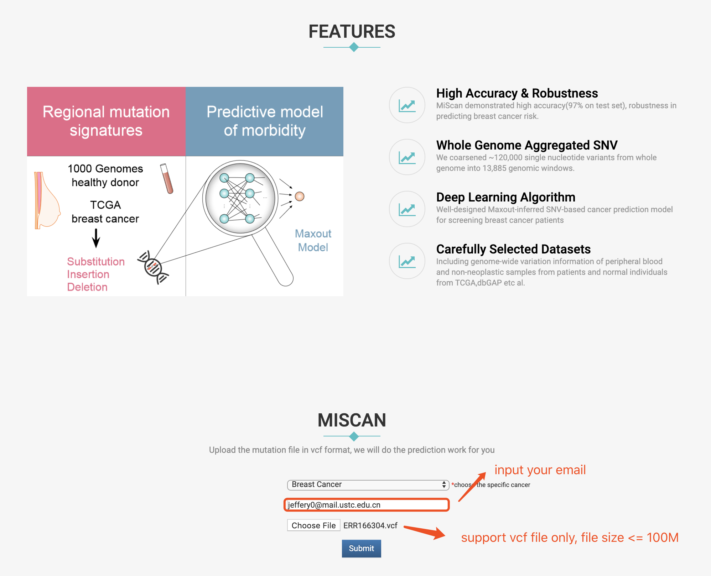
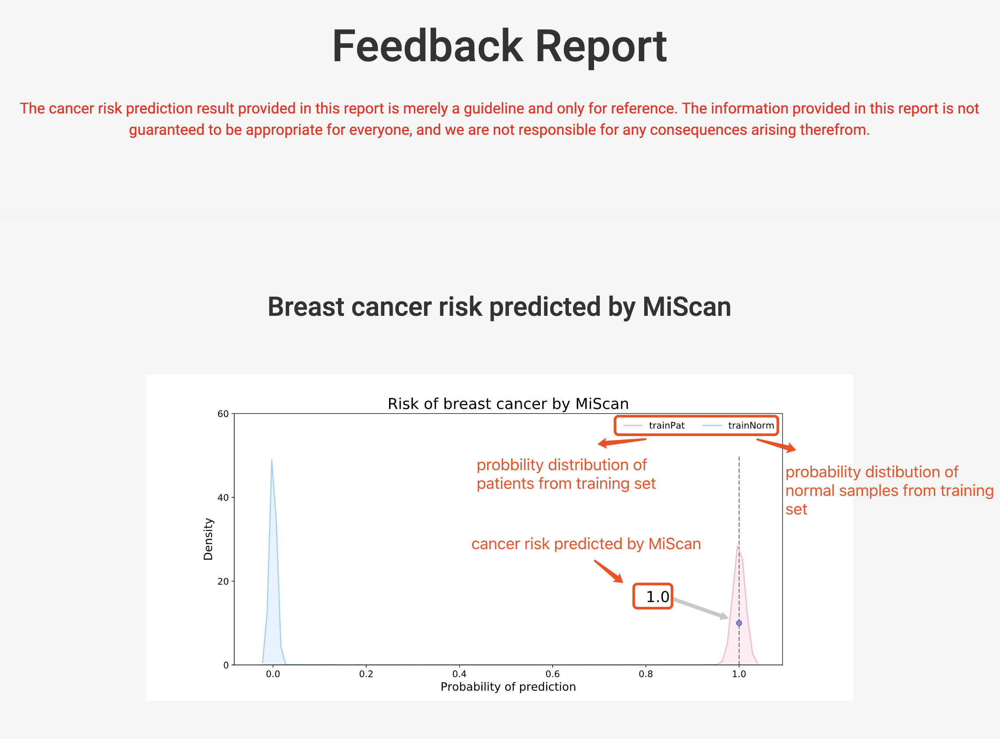
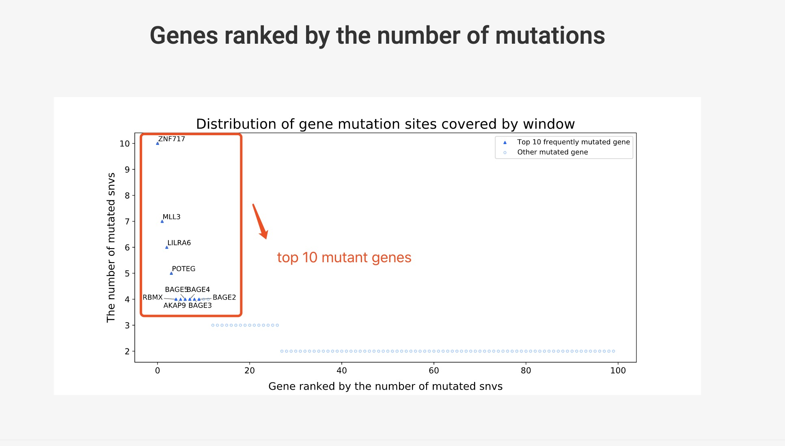

Website
============

To promote the widespread use of MiScan for breast cancer risk prediction and prevention, we constructed an
interactive website_ for the public By uploading a VCF file containing personal genotype information, users can acquire
a report on breast cancer risk within one minute. The feedback report contains predicted risk of getting breast cancer,
as well as a ranked list of most highly mutated genes.

Below shows the website usage and report:

website index page
~~~~~~~~~~~~~~~~~~~~~~~~

website VCF upload page
~~~~~~~~~~~~~~~~~~~~~~~~

MiScan Report
~~~~~~~~~~~~~~~~~~~~~~~~

.. _website: http://galaxy.ustc.edu.cn
